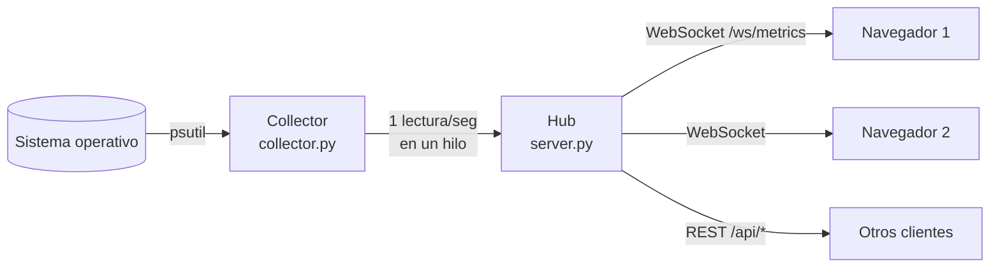

# 🖥️ ZulemaOS Monitor


Monitor de sistema en tiempo real hecho con **Python, FastAPI y psutil**, con una interfaz web retro
y dos ayudantes muy especiales: **Thor y Hela**, mis gatos, que reaccionan a la carga de la CPU
(duermen la siesta si el PC está tranquilo y corren por toda la casa cuando se pone al 100 %).

**🔗 Demo en vivo:** https://zulema1904.github.io/monitor/ (con datos simulados)
· También se abre como **Monitor.exe** dentro de mi portfolio, [ZulemaOS](https://zulema1904.github.io).

## Qué muestra

- **CPU**: uso total, gráfica de los últimos 2 minutos y barras por núcleo
- **Memoria**: RAM usada, total y swap
- **Red**: velocidad de subida y bajada en tiempo real y totales desde el arranque
- **Discos**: ocupación de cada unidad
- **Procesos**: los que más CPU consumen, con su PID y memoria
- **Sistema**: equipo, sistema operativo, modelo de procesador, núcleos y tiempo encendido

## Cómo funciona



Algunas decisiones de diseño:

- **Un único recolector compartido.** El % de CPU se calcula "desde la lectura anterior", así que si
  cada navegador pidiera sus propias lecturas se pisarían entre sí. El `Hub` toma una lectura por
  segundo y la reparte a todos los clientes conectados.
- **WebSocket en lugar de preguntar cada segundo.** El servidor envía los datos en cuanto los tiene,
  sin que el navegador tenga que repetir peticiones HTTP.
- **psutil en un hilo aparte** (`asyncio.to_thread`) para que las lecturas, que son bloqueantes,
  no congelen el servidor asíncrono.
- **Sólo escucha en `127.0.0.1`.** La lista de procesos es información sensible y no debe quedar
  expuesta al resto de la red. El CORS sólo permite a la propia interfaz y a mi portfolio.
- **Modo demo.** GitHub Pages no puede ejecutar Python, así que la interfaz incluye un generador de
  datos simulados con la misma forma que los reales. Si el servidor está en marcha en tu PC, el botón
  **"Conectar a mi PC"** cambia a tus datos reales, incluso desde la demo publicada.
- **Sin librerías en el frontend.** Las gráficas se dibujan a mano en `<canvas>` y los gatos son
  pixel-art definido como texto.

## Pruébalo en tu PC

Necesitas Python 3.10 o superior.

```bash
git clone https://github.com/Zulema1904/zulemaos-monitor.git
cd zulemaos-monitor
python -m venv .venv
.venv\Scripts\activate          # Windows  (en Linux/Mac: source .venv/bin/activate)
pip install -r requirements.txt
python -m monitor
```

Se abrirá el navegador en http://127.0.0.1:8000. Opciones: `--port 9000`, `--no-browser`.
Para probar sólo el recolector en la terminal: `python -m monitor.collector`.

## API

| Método | Ruta | Descripción |
| --- | --- | --- |
| GET | `/api/system` | Información fija del equipo |
| GET | `/api/metrics` | Última lectura completa |
| GET | `/api/history` | Últimos 2 minutos (CPU, RAM y red) |
| WS | `/ws/metrics` | Mensaje `hello` al conectar y después una lectura `metrics` por segundo |
| GET | `/docs` | Documentación interactiva generada por FastAPI |

## Tests

```bash
pip install -r requirements-dev.txt
pytest
```

Se comprueban la forma y los rangos de las lecturas, los cálculos propios (velocidad de red y % de
CPU por proceso, con datos simulados), la API REST, el WebSocket y el CORS. GitHub Actions los
ejecuta en Windows y Linux en cada cambio.

## Estructura

```
monitor/
  collector.py   Lecturas del sistema con psutil
  server.py      API FastAPI + WebSocket + Hub
  __main__.py    Arranque: python -m monitor
web/
  index.html     Interfaz
  style.css      Estilo retro ZulemaOS
  app.js         Conexión, gráficas y comportamiento de los gatos
  demo.js        Datos simulados para el modo demo
  sprites.js     Pixel-art de Thor y Hela
tests/           pytest
```

---

Hecho por **Zulema Gutiérrez** · [Portfolio](https://zulema1904.github.io) · [LinkedIn](https://www.linkedin.com/in/zulema-guti%C3%A9rrez-504397312)
